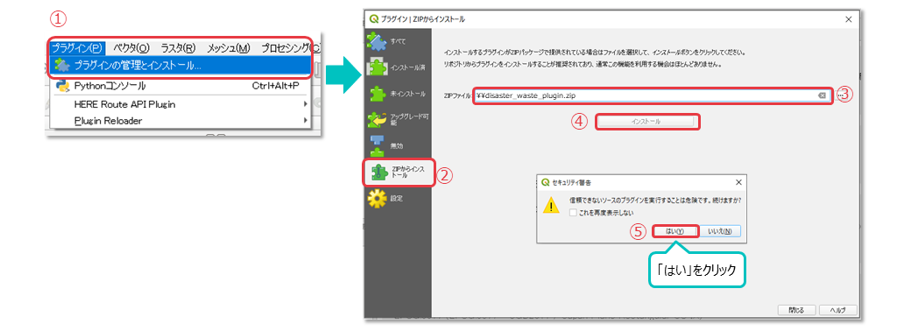
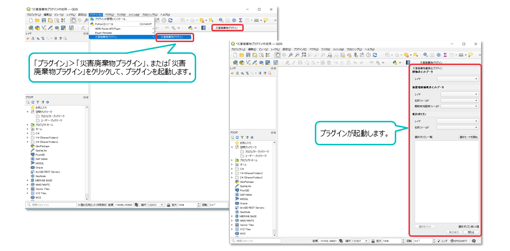
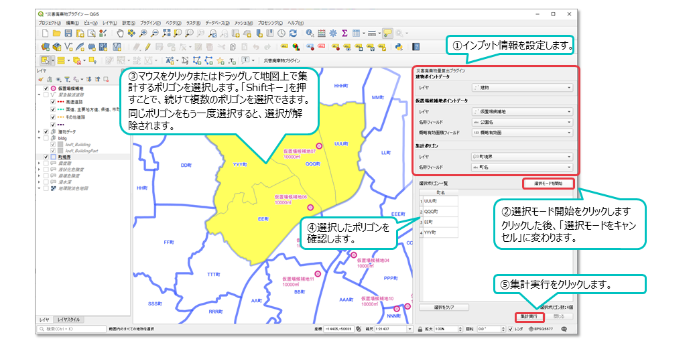
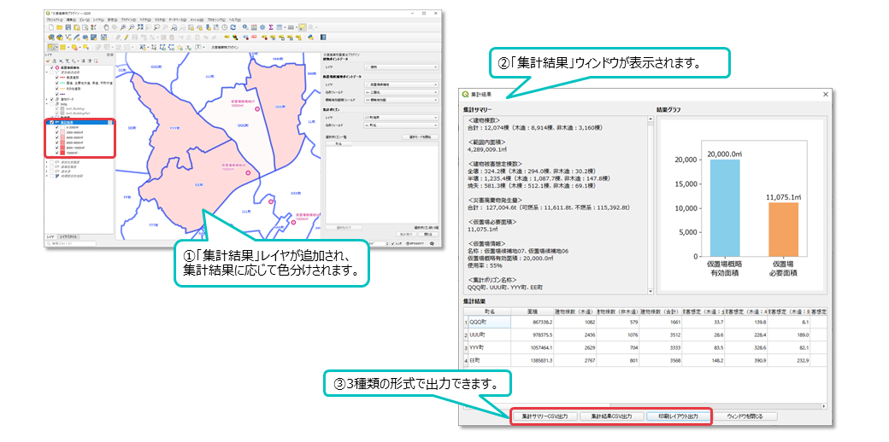
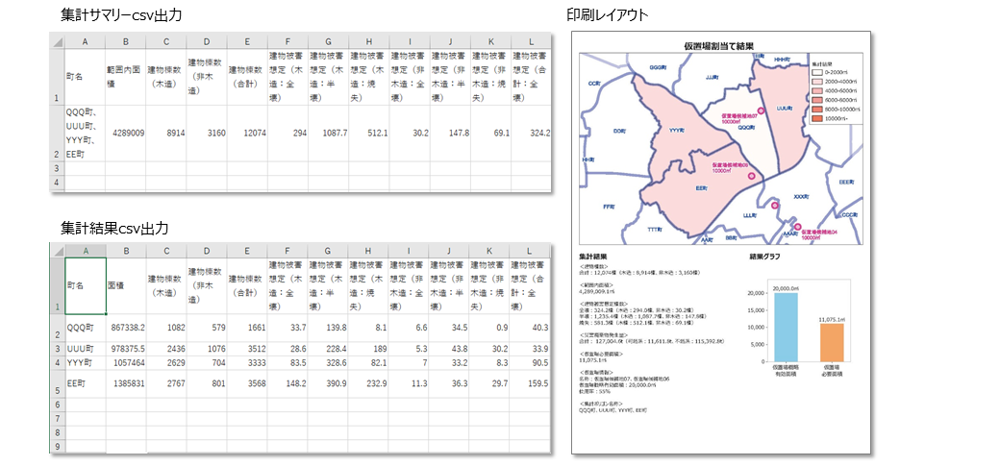

# FY2022 Project PLATEAU UC22-010「災害廃棄物発生量シミュレーション」の成果物

## 1. 概要
3D都市モデルを活用して地震等の災害発生時に生じる災害廃棄物発生量を予測し、その集計結果と指定した災害廃棄物の仮置場候補地の可集積面積との比較を行うことにより、仮置場の割当て範囲の妥当性の検討を支援するQGIS向けのプラグインパッケージです。
プラグインの利用には、以下の3種類のGISデータをあらかじめ用意する必要があります。
データの整備方法は、[「マニュアル：データ整備編」](doc/manual_dataprep.pdf) を参照してください。
プラグインの操作方法は、[「マニュアル：プラグインシステム編」](doc/manual_howtouseplugin.pdf) を参照してください。

|  必要なデータ |  説明  |
| ---- | ---- |
|  建物ポイント  |  建物ごとに災害廃棄物発生量、必要面積等を計算したポイントデータ 3D都市モデルデータ（LOD1）を加工して作成  |
|  仮置場候補地ポイント  |  仮置場候補地に仮置場名称と概略有効面積を入れたポイントデータ  |
|  集計ポリゴン  |  町、町丁目等のポリゴンデータ  |

建物ポイントのデータを作成するためには以下のデータをあらかじめ用意する必要があります。詳細は[「マニュアル：データ整備編」](doc/manual_dataprep.pdf) を参照してください。
|  必要なデータ |  説明  |
| ---- | ---- |
|  3D都市モデル（属性情報）  |  建築物の建築年、延床面積、建物階数、構造種別  |
|  災害外力（GIS)  |  地震動、液状化、急傾斜地崩壊、津波浸水、火災の外力やそれによるリスクを評価する係数  |
|  被害の確率  |  災害外力に対して建物の全壊被害率・半壊被害率を計算するための係数  |

プラグイン試行操作用データのセットは、[「プラグイン試行用サンプルデータ」](sampledata/sampledata_plugin/)を参考にしてください。プラグインインストール後、サンプルデータのプロジェクトファイル（[DisasterWastePlugin.qgz](sampledata/sampledata_plugin/DisasterWastePlugin.qgz)）をQGISで開くことで、操作を試すことができます。 
[「マニュアル：データ整備編」](doc/manual_dataprep.pdf)に沿って建物ポイントを作成するために必要な、建物サンプルデータ、災害外力サンプルデータは[「災害廃棄物発生量等算定シート試行用サンプルデータ」](sampledata/sampledata_input/)に保存しています。建物サンプルデータから[「災害廃棄物発生量等算定シート」](doc/worksheet_EstimatingDisasterWaste.xlsx)を用いて災害廃棄物発生量等を計算した結果の[「災害廃棄物発生量等算定シート入力サンプル」](sampledata/sampledata_input/worksheet_EstimatingDisasterWaste_sample.xlsx)も同じフォルダに保存しています。
なお、これらのデータはユースケース開発の対象地である横浜市を対象に作成をしていますが、プラグインや算定シート試行用に作成したサンプルデータであり、実際のものとは異なることにご留意ください。

## 2．「災害廃棄物発生量シミュレーション」について
### ユースケースの概要
令和4年度の3D都市モデルを活用した社会課題解決型ユースケース開発業務「災害廃棄物発生量シミュレーション」では、大規模災害からの円滑な復旧･復興に向けて、3D都市モデルに想定される地震等の外力データを重ね合わせ、これらを入力値とした被害想定のシミュレーションから、建物被害の発生状況・災害廃棄物発生量を集計し、災害廃棄物の処理に要する仮置場必要面積と比較シミュレーションするQGISプラグインを開発しました。

シミュレーション結果を活用し、対象自治体全域における仮置場割当てを実施した上で、仮置場が不足する用地周辺での新たな用地確保や、発災後の仮置場運営に対する市内産業廃棄物処理業者との連携等に役立てることができます。

本ユースケースでは、自治体職員自らが3D都市モデルを活用した政策検討ができるよう、開発したシミュレーションモデル等をQGISのプラグインとして提供しています。

### 開発システムの概要
仮置場割当ての検討においては、仮置場候補地として想定した用地の取扱いに関する庁内調整の必要性や、新たな用地確保などの機会を捉えた継続的な見直しが求められます。

本システムは、このような仮置場割当て検討の継続的な見直しを支援するQGISプラグインです。
町･町丁目単位等の施策検討に有効な範囲の地域を設定し、そこから発生する災害廃棄物と仮置場候補地の概略有効面積との比較を行うことで、割当て範囲としての妥当性を確認しながら検討することができます。
これらの仮置場割当て結果は、csv形式や割当て範囲の地図を示したPDF形式での出力もできます。関係者間での協議結果の集約･整理として、ご活用ください。

## 3．利用手順

### 動作環境

- 動作環境：Windows10 64bit、Windows11 64bit
- QGISバージョン：3.22 LTR

### インストール方法

- GitHubからプラグインの[Zipファイル](https://github.com/Project-PLATEAU/UC22-010-QGIS-DisasterWastePlugin/archive/refs/tags/v1.0.zip)をダウンロードします。
- QGISのメニューバー「プラグイン」からインストールします。

### 基本操作方法
#### プラグインの起動
QGISメニューバー 「プラグイン」から選択、もしくはツールバーから 「災害廃棄物プラグイン」をクリックすると起動します。

#### 基本操作
1. プラグインで使用するデータをインプット情報として設定します。

|設定項目１|設定項目２|使用するデータ|
|:------|:-----|:------|
|建物ポイント   |レイヤ   |建物ポイント   |
|仮置場候補地ポイント  |レイヤ   |仮置場候補地ポイント   |
|〃　　  |名称フィールド    |仮置場候補地の名称の属性     |
|〃　　  |概略有効面積フィールド    |仮置場候補地の概略有効面積の属性     |
|集計ポリゴン   |レイヤ   |集計を行うポリゴン   |
|〃　　  |名称フィールド    |集計ポリゴンの名称の属性     |

[「プラグイン試行用サンプルデータ」](sampledata/sampledata_plugin/)のプロジェクトファイル（[DisasterWastePlugin.qgz](sampledata/sampledata_plugin/DisasterWastePlugin.qgz)）をQGISで開くことで、建物ポイント（tatemono.shp）、仮置場候補地ポイント（kariokibakouhochi.shp）、集計ポリゴン（machi.shp）をQGIS上で展開してプラグインの操作を試すことができます。

2. 「選択モード開始」をクリックすると、仮置場割当て範囲を検討するモードになります。
3. 地図上で集計するポリゴンを選択します。
4. 選択ポリゴン一覧で選択したポリゴンの一覧が確認できます。
5. 「集計実行」をクリックすると、選択した範囲における災害廃棄物発生量や仮置場必要面積の集計、選択範囲内にある仮置場候補地の概略有効面積の集計が実行されます。

#### 集計結果の確認
1. 「集計実行」をクリックすると、「集計結果」レイヤが追加されます。ポリゴンごとの仮置場必要面積ごとに色分けした結果が表示されます。
2. 同時に「集計結果」ウィンドウが表示されます。「集計結果」ウィンドウでは、「集計結果サマリー」「結果グラフ」「集計結果」を表示します。
3. 集計結果は、「集計結果サマリーcsv出力」「集計結果csv出力」「印刷レイアウト」の3種類に出力できます。

#### 操作マニュアル
詳細については、マニュアルをご確認ください。
* [操作マニュアル　データ整備編](doc/manual_dataprep.pdf) (PDF)
    * データ整備の際に必要となる災害廃棄物量等の算定は、[災害廃棄物発生量等算定シート.xlsx](doc/worksheet_EstimatingDisasterWaste.xlsx)をご利用ください。
* [操作マニュアル　プラグインシステム編](doc/manual_howtouseplugin.pdf) (PDF)

## ライセンス <!-- 定型文のため変更しない -->
* 本プログラムはGPLv2ライセンスの下に頒布されます。
* ソースコードおよび関連ドキュメントの著作権は国土交通省に帰属します。
* 本ドキュメントは[Project PLATEAUのサイトポリシー](https://www.mlit.go.jp/plateau/site-policy/)（CCBY4.0および政府標準利用規約2.0）に従い提供されています。

## 注意事項 <!-- 定型文のため変更しない -->

* 本レポジトリは参考資料として提供しているものです。動作保証は行っておりません。
* 予告なく変更・削除する可能性があります。
* 本レポジトリの利用により生じた損失及び損害等について、国土交通省はいかなる責任も負わないものとします。

## 参考資料　 <!-- 各リンクは納品時に更新 -->
* 災害廃棄物発生量シミュレーション技術検証レポート: https://www.mlit.go.jp/plateau/file/libraries/doc/plateau_tech_doc_0015_ver01.pdf
*  PLATEAU Webサイト Use caseページ「災害廃棄物発生量シミュレーション」: https://www.mlit.go.jp/plateau/use-case/uc22-010/
* [操作マニュアル　データ整備編](doc/manual_dataprep.pdf) 
* [操作マニュアル　プラグインシステム編](doc/manual_howtouseplugin.pdf)
* [プラグイン試行用サンプルデータ](sampledata/sampledata_plugin/)
* [災害廃棄物発生量等算定シート](doc/worksheet_EstimatingDisasterWaste.xlsx)
* [災害廃棄物発生量等算定シート試行用サンプルデータ](sampledata/sampledata_input/)
